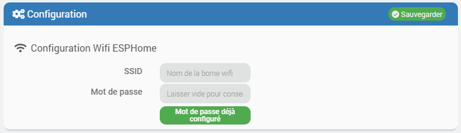
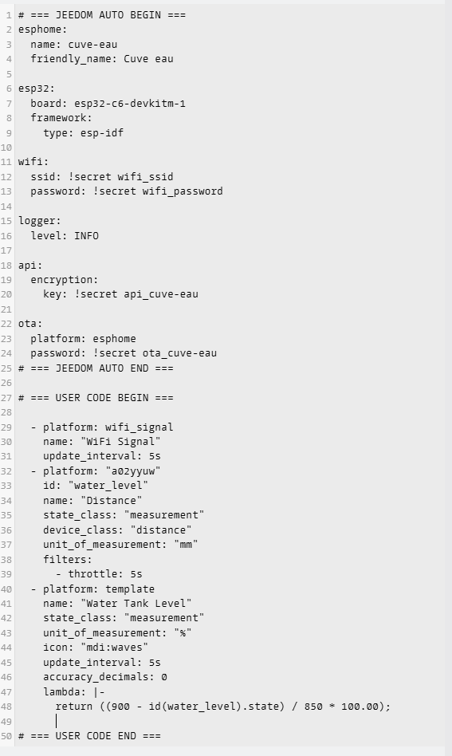

# 📘 Documentation du Plugin ESPhome

## Présentation

### Le plugin ESPHome permet de gérer facilement des appareils ESP32 / ESP8266 depuis Jeedom, sans passer par la ligne de commande.

  Il permet de :

  - Créer des équipements ESPHome

  - Générer automatiquement la configuration ESPHome (YAML)

  - Valider la configuration

  - Installer ou mettre à jour le firmware (USB ou OTA)

  - Administrer les ESP à distance

## Prérequis

### Matériel

  Un ESP compatible :

  - ESP32

  - ESP8266

  - Connexion réseau fonctionnelle (Wi-Fi)

> <strong> IMPORTANT</strong>
> 
> Pour les autres cartes que ESPhome peut gérer, je n'ai pas pu les tester. Merci de m'informer si vous avez d'autres cartes que ESPhome (Officiel) peut gérer.

### Logiciel

  - Jeedom ≥ 4.4

  - Plugin ESPHome installé et actif

  - ESPHome installé automatiquement par le plugin

### Renseignement du compte et mot de passe wifi
Il faut renseigner le compte et le mot de passe dans le panneau de configuration du plugin ESPhome.

## Création d’un équipement ESPHome
Aller dans Plugin->Protocole domotique->ESPhome puis cliquer sur **Ajouter**.
Renseiger:
- **Nom du ESPhome**
- **Obget parent**
- **Catégorie**
- **Activer l'equipement**
- **Renseigner IP du device (Optionnel)

### Port série (USB)
- Branchez votre ESP au Jeedom

- Sélectionnez le port (/dev/ttyUSB0, /dev/ttyACM0, etc

> <strong> ATTENTION</strong>
> 
> Obligatoire uniquement pour une première installation USB.

### Génération du fichier YAML
Le fichier ESPHome est généré automatiquement lors de la sauvegarde de l’équipement.

### Règles importantes sur le nom

- ❌ Pas d’accent

- ❌ Pas de caractères spéciaux

## Onglet YAML
### Visualisation
Dans l’onglet YAML, vous pouvez :

- Voir la configuration générée

- Modifier manuellement le YAML si nécessaire

> <strong> NOTE</strong>
> 
> **Exemple**.
> 
> 
>
> **Autre exemple Climate**.
><pre>
>  # === JEEDOM AUTO BEGIN ===
>substitutions:
>  name: (le nom de l'équipement)
>  friendly_name: (le nom de l'équipement)
>
>  nom_wifi: !secret wifi_ssid
>  pass: !secret wifi_password
>
>  wifi_ap_ssid: "AC-wifi"
>  wifi_ap_password: "slwf01pro"
>
>  niv: INFO
>
>  cle: !secret api_(le nom de l'équipement)
>  pass_ota: !secret ota_(le nom de l'équipement)
>
>  visual_min_temperature: "17 °C"
>  visual_max_temperature: "30 °C"
>  visual_temperature_step: "1.0 °C"
># === JEEDOM AUTO END ===
>
>
># === Votre Configuration ===
>
>esphome:
>  name: "${name}"
>  friendly_name: "${friendly_name}"
>
>esp8266:
>  board: esp12e
>
>wifi:
>  ssid: !secret wifi_ssid
>  password: !secret wifi_password
>  ap:
>    ssid: "${wifi_ap_ssid}"
>    password: "${wifi_ap_password}"
>
>captive_portal:
>
>logger:
>  baud_rate: 0
>
>api:
>  encryption:
>    key: ${cle}
>  reboot_timeout: 0s
>
>ota:
>  - platform: esphome
>    password: ${pass_ota}
>
>uart:
>  tx_pin: 12
>  rx_pin: 14
>  baud_rate: 9600
>
>button:
>  - platform: factory_reset
>    name: "Réinitialisation d'usine"
>
>  - platform: template
>    name: "Basculement de l'affichage de ${friendly_name}"
>    icon: mdi:theme-light-dark
>    on_press:
>      - midea_ac.display_toggle:
>          id: midea_climate
>
>climate:
>  - platform: midea
>    id: midea_climate
>    name: "${friendly_name}"
>    autoconf: true
>    period: 2s
>    timeout: 2s
>    num_attempts: 2
>    beeper: true
>
>    visual:
>      min_temperature: "${visual_min_temperature}"
>      max_temperature: "${visual_max_temperature}"
>      temperature_step: "${visual_temperature_step}"
>
>    supported_modes:
>      - FAN_ONLY
>      - HEAT_COOL
>      - COOL
>      - HEAT
>      - DRY
>
>    custom_fan_modes:
>      - SILENT
>      - TURBO
>
>    supported_presets:
>      - ECO
>      - BOOST
>      - SLEEP
>
>    custom_presets:
>      - FREEZE_PROTECTION
>
>   supported_swing_modes:
>      - VERTICAL
>      - HORIZONTAL
>      - BOTH
>
>switch:
>  - platform: template
>    name: "Bip ${friendly_name}"
>    icon: mdi:volume-source
>    restore_mode: RESTORE_DEFAULT_OFF
>    optimistic: true
>    turn_on_action:
>      - midea_ac.beeper_on
>    turn_off_action:
>      - midea_ac.beeper_off
>
>remote_transmitter:
>  pin: GPIO13
>  carrier_duty_percent: 100%
>
>sensor:
>  - platform: wifi_signal
>    name: "Signal Wi-Fi de ${friendly_name}"
>    update_interval: 60s
>
>  - platform: uptime
>    id: uptime_sec
>    internal: true
>
>script:
>  - id: power_toggle
>    then:
>      - midea_ac.power_toggle
>
>web_server:
>  port: 80
>  local: true
>
># === Votre Configuration FIN ===
></pre>

Vous pouver modifier ou rajouter que entre **# === Votre Configuration ===** et **# === Votre Configuration FIN ===**.
Puis cliquer sur sauvegarder pour que les paramètres soit pris en compte.

> <strong> ATTENTION</strong>
>
> Il ne faut sur tous pas supprimer **# === Votre Configuration ===** et **# === Votre Configuration FIN ===** au moment de la sauvegarde.

## Validation de la configuration
### Vérifier le YAML

- Cliquez sur Validation YAML

- Le plugin analyse la configuration
### Résultat attendu
- ✅ Succès : **INFO Configuration is valid!**
- ❌ Erreur : **ERROR Error while reading configuration**

> <strong> IMPORTANT</strong>
<
>Tant que la validation échoue, l’installation YAML USB est bloquée.

## Installation YAML USB
### Première installation (USB)

- Branchez l’ESP en USB

- Sélectionnez le port série

- Cliquez sur Installation YAML USB

- Suivez la progression

## Mise à jour OTA (sans fil)
Si l’ESP est déjà installé :

- Le plugin détecte automatiquement le mode OTA

- Aucune action USB requise

- Le configuration yaml est envoyé par Wi-Fi
- ✅ Succès : **INFO OTA successful**

## API sécurisée ESPHome

Le plugin utilise l’API native ESPHome chiffrée.

### Clé d’encryption

- Générée automatiquement

- Unique par équipement

- Protège la communication Jeedom ↔ ESP

