# Documentation du Plugin Jardin & Potager

  

Activer le plugin
===
Comme n’importe quel plugin JEEDOM, il est nécessaire d’activer le plugin pour qu’il fonctionne

 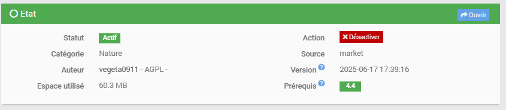
  

Configuration du plugin
===
Pensez à **activer** le plugin suite à son installation.

Si vous désirez profitez des fonctionnalités de notification, pensez à renseigner dans le champ prévu a cet effet dans les paramètres un moyen de notification : 
- Télégram
- Mail
- SMS
  
Et pensez à **sauvegarder** !
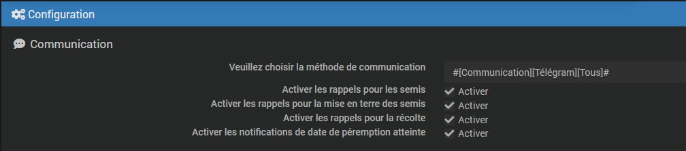

Vous pouvez aussi activer si vous le désirez un accès rapide à vos potager (via le menu Accueil de Jeedom) , en activant le panneau desktop

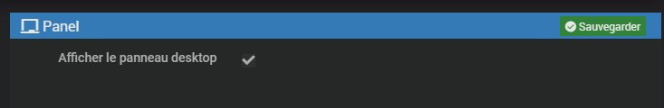

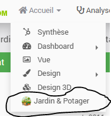

Ajouter des semences / potagers
===
Cliquez sur le  pour ajouter de nouvelles semences et/ou potager

Il est impératif ‘d’activer’ les ‘semences’/’potager’ pour qu’ils soient fonctionnels !

Libre à vous de remplir ou non les informations demandées.

****Le type : Potager / Semence****
Vous creez soit des : 
- semence
- potager

Cela se précise via le champ type.
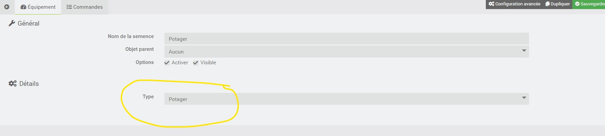
  Vous pourrez ensuite attribuer/positionner vos semences dans vos potager via le bouton 'Gérer mes potagers'
 

***visuel de vos semences***
Par défaut , vos semences sont des 'graines'
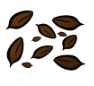
Mais si vous les déclarez comme semées, elles vont devenir des graines en godet
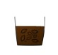
Et au bout de 10j , magie , elles vont germer
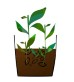

**Astuce pour le nom de semences en double/triple/etc**
Jeedom interdit d'avoir plusieurs équipements du même nom dans le meme objet parent !
Afin de pouvoir créer plusieurs tomates (d'espèce différentes) , une astuce a été mise en place
écrivez simplement : **lenomdevotreespece@index**

*exemple :* 
- tomate @1
- tomate @2
- poreau     @456

Le plugin ignorera tout ce qui trouve à partir du '@' !

Déclarer un semis
===

Comme expliqué précédemment, pour une même semence, on peut déclarer plusieurs semis. Prenons le cas de la semence 'Radis de 18 jours', le jardinier va certainement semis en plusieurs fois. On peut donc créer un premier semis (disons premier semis le 1 mai) , puis un second 1 mois plus tard , etc ,etc

pour ce faire, il faut se rendre sur la fiche de la semence -> Onglet Gestion -> rechercher sa semence et la sélectionner
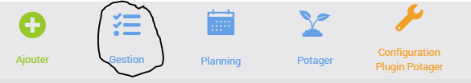

Puis une fois sur la fiche de notre semence, cliquer sur l'onglet 'semis /Cultures'

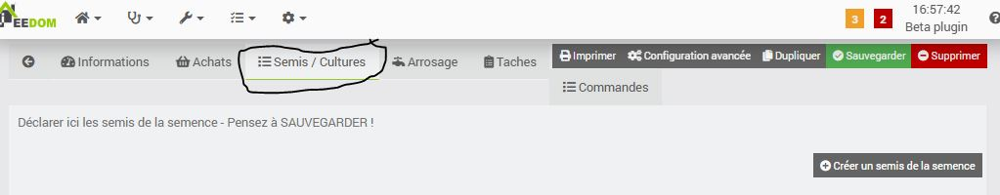

Vous avez un bouton pour déclarer de nouveau semis

Renseignez les informations du semis en temps voulu

Et pensez à SAUVEGARDER

Il existe d'autre façon de créer des semis ou de déclarer un semis comme 'semé/récolté' , c'est via la vue 'planning' , n'hésitez pas à vous référer à cette section de la documentation

Planning des semences
===

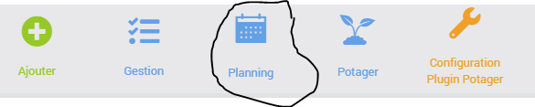

La vue planning permet de visualiser rapidement vos semences, lorsqu’il faut les semer, les mettre en terre etc. Un certain nombre d’icone sont affichées à côté de vos semences pour facilement identifier : son type (légume/plante/etc) , la quantité semé / si vous avez épuisé vos semences / …

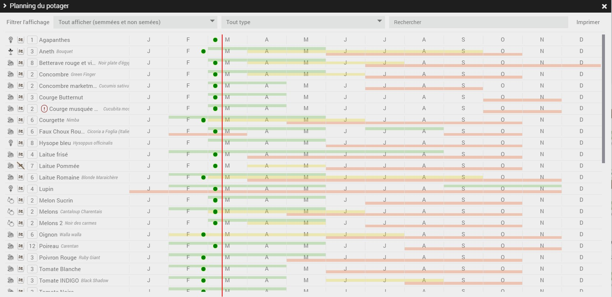
  
  
***Actions rapides***
Il est possible d’effectuer un clic droit sur une semence pour rapidement la déclarer comme :
- semée
- mise en terre
- récoltée
*et ainsi afficher une pastille de couleur à la date associer*

*NB : en maintenant la touche CTRL lorsque vous sélectionné une option du menu clic-droit (ex :marqué comme semé) , vous serez en mesure de définir manuellement la date , et non d’avoir la date du jour imposée.*
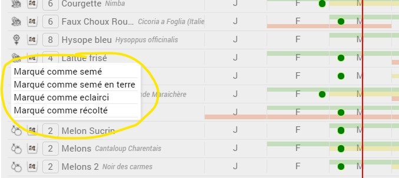
  
  *NB : Si vous désirez annuler une mise en terre/un semis/... il suffit de repasser par ce menu, il vous proposera d'annuler*
  

Un bouton **imprimer** permet de générer une page à imprimer optimiser pour économiser de l’encre et avoir une vue synthétique de vos semences.

  

Le plan du potager
===

Rendez vous sur la vue 'Potager' via la barre commune du plugin

Dessinez vos potagers !

Commencez par choisir la bonne dimension de vos potager, pour ce faire , en bas à droite de chaque potager , cliquez et maintenez le clic sur le petit carré pour le redimensionner.

Puis ajoutez et positionnez vos semences, vous pouvez ajouter des carrer potager, des arbres, des clotures, des ruisseaux....

**Déplacer un élément**
Rien de plus facile, cliquez dessus et déplacez le !

**Déplacer TOUS les éléments (en même temps)**
Cliquez en MAINTENANT la touche CTR sur un élément quelconque déplacez le ! Tous se déplacera en même temps !

**Redimensionner un élément**
Pour redimensionner vos éléments , utilisez le petit carré bleu en bas a droite 
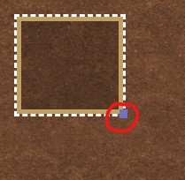

**Effectuer une rotation à un élément**
Amenez le curseur légèrement en dessous du carré violet, le curseur va se transformer en 'croix' , et un pop up vous invitera a cliquer ( et maintenir le clic) pour effectuer une rotation de l'élément !
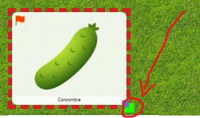
  
  **supprimer un élément**
  Effectuez un clic-droit pour faire apparaitre un menu qui vous proposera de supprimer l'élément désiré (semence/arbre/etc...)
 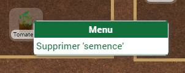

**Permaculture - Associer les espèces entres-elles !**
lorsque vous allez déplacer une semence dans votre potager afin de la positionner, si cette dernière est détectée automatiquement et qu'une association est possible, un halo rouge ou vert vous invitera a la rapprocher d'une autre semence ou à l'éloigner ...

*Dans l'exemple ci-dessus, on a sélectionné la Tomate, le programme nous invite a rapprocher la tomate du Basilic , et a l'éloigner du Concombre !*

**Détail d'une semence & détection automatique**
Lorsque vous passer le curseur sur une espèce et que vous le laisser dessus , au bout d'une seconde un 'pop up' apparait pour vous donner quelques info rapide.
Si l'espèce en question est détecté par le programme, cela sera précisé et les associations/non associations s'afficheront de même !

*Une petite subtilité, le programme différencie les associations en deux catégorie (de même pour les non-associations / incompatibilités)* :
- *La semence sélectionnée est invitée a être associé avec les especes xxxx , car les espèces xxx vont lui être bénéfiques (halo vert plutot foncé)*
- *La semence sélectionnée est invitée a être associé avec les especes yyyyy, car elle va être bénéfique pour les espèces yyyy (halo vert plutot clair)*

**Afficher un quadrillage sur votre potager**
Effectuez un clic-droit sur le potager (pas sur un élément) pour faire afficher le menu du potager

Sélectionnez '**Afficher le quadrillage'** 

**Générer un schéma du potager imprimable**
Le bouton **imprimer** vous génèrera un plan !

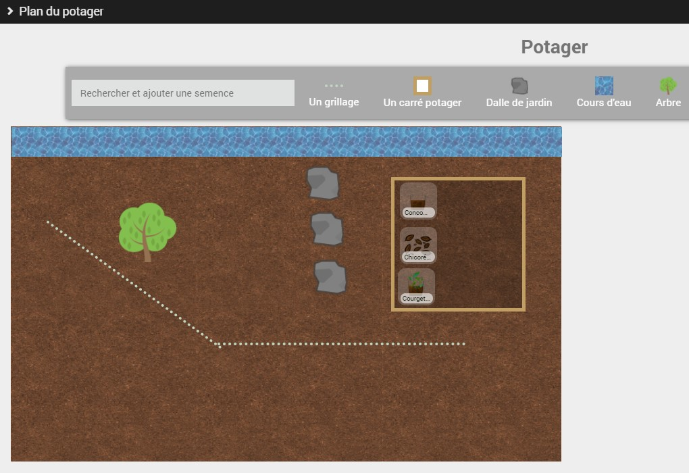

***example de schéma généré du plan***
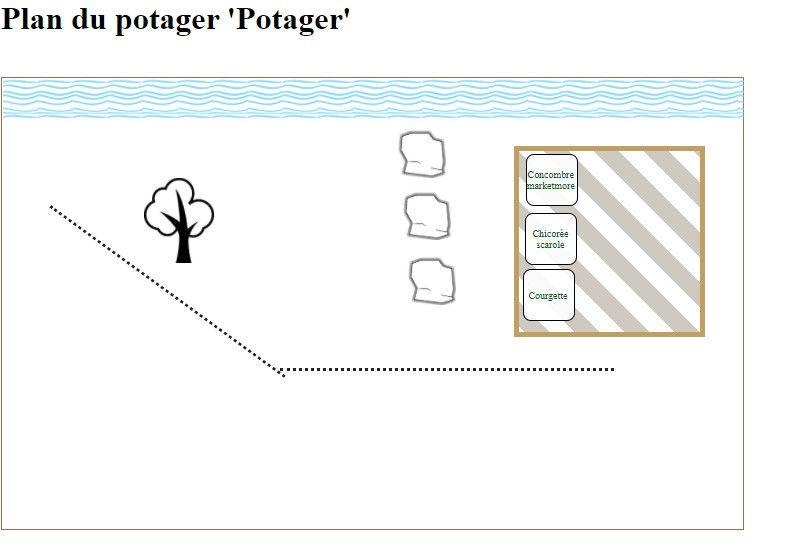

