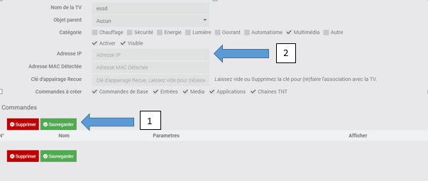
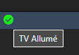

# Plugin WebOStvLG

# Documentation du Plugin LG WebOS

Ce plugin permet de contrôler les TV(s) LG.

# Configuration du plugin

1 - Pensez à **allumer** votre TV LG avant de faire une action.
Alors la premiere étape qui va tout faire a votre place c'est a dire remplir l'adresse ip, Adresse MAC, Clé d'appairage.
tout ça en **sauvegardant** ! 

2 - sinon si la premiere étape ne fonctionne pas :(, alors remplir la section adresse ip puis sauvegarder.

3 - apres avoir cliqué sur le bouton sauvegarder ne pas oublier de valider l'autorisation de connection sur votre tv LG.

il y a aussi le statue Pour savoir si la TV est allumé ou pas 

**Si y a des soucis avec webos v6 ou supérieur merci de me contacter.**
